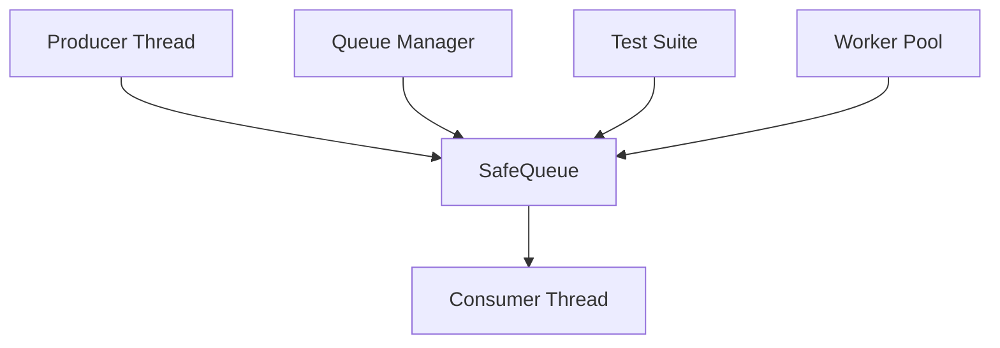

## Product Overview

完善safe_queue.cpp文件，修复语法错误并实现完整的线程安全队列功能

## Core Features

- 修复safe_queue.cpp中的语法错误
- 完善线程安全的队列实现
- 添加完整的工作线程功能
- 提供实际可运行的测试代码
- 确保多线程环境下的正确性和性能

## Tech Stack

- 编程语言: C++11
- 线程库: std::thread, std::mutex, std::condition_variable
- 测试框架: 简单的main函数测试
- 构建工具: g++编译器
- 平台: 跨平台兼容

## Architecture Design

### System Architecture

采用生产者-消费者模式设计，包含核心队列组件和工作线程管理器：



### Module Division

- **SafeQueue模块**: 核心线程安全队列实现
- 使用std::mutex保护共享数据
- std::condition_variable实现线程同步
- 提供push, pop, try_pop等接口
- **WorkerThread模块**: 工作线程管理
- 线程池管理
- 任务分发和执行
- **TestModule模块**: 测试验证
- 多线程并发测试
- 性能基准测试

### Data Flow


## Implementation Details

### Core Directory Structure

```
DataStructure/
├── safe_queue.cpp          # 主要实现文件
├── safe_queue.h            # 头文件声明
├── test_safe_queue.cpp     # 测试文件
├── worker_thread.cpp       # 工作线程实现
└── README.md              # 使用说明
```

### Key Code Structures

```cpp
// 核心队列类结构
template<typename T>
class SafeQueue {
private:
    std::queue<T> queue_;
    mutable std::mutex mutex_;
    std::condition_variable condition_;
    
public:
    void push(const T& value);
    bool try_pop(T& value);
    void wait_and_pop(T& value);
    bool empty() const;
    size_t size() const;
};

// 工作线程类
class WorkerThread {
private:
    SafeQueue<std::function<void()>> task_queue_;
    std::vector<std::thread> workers_;
    bool stop_;
    
public:
    WorkerThread(size_t threads);
    void enqueue(std::function<void()> task);
    ~WorkerThread();
};
```

### Technical Implementation Plan

1. **问题诊断**: 分析现有代码的语法错误和逻辑缺陷
2. **队列重构**: 重新实现线程安全的队列操作
3. **同步机制**: 完善互斥锁和条件变量的使用
4. **工作线程**: 实现线程池和任务调度
5. **测试验证**: 编写全面的测试用例

### Integration Points

- 队列与工作线程的集成接口
- 测试模块与核心功能的集成
- 错误处理和异常安全机制

## Technical Considerations

### Performance Optimization

- 使用移动语义减少拷贝开销
- 批量操作减少锁竞争
- 合理的队列大小避免内存溢出

### Security Measures

- RAII锁管理防止死锁
- 异常安全的队列操作
- 线程安全的资源清理

### Scalability

- 支持动态调整工作线程数量
- 可配置的队列容量限制
- 模板化设计支持多种数据类型

### Development Workflow

- 编写单元测试验证功能
- 使用valgrind检测内存泄漏
- 多线程压力测试验证稳定性

## Agent Extensions

### SubAgent

- **code-explorer** (from <subagent>)
- Purpose: 分析现有的safe_queue.cpp文件，查找语法错误和功能缺陷
- Expected outcome: 获得完整的问题清单和代码结构分析